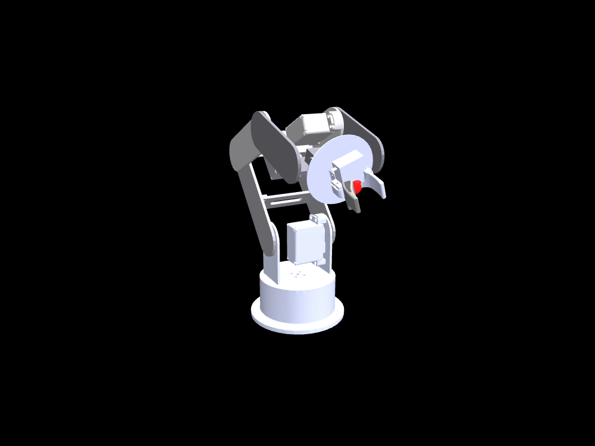
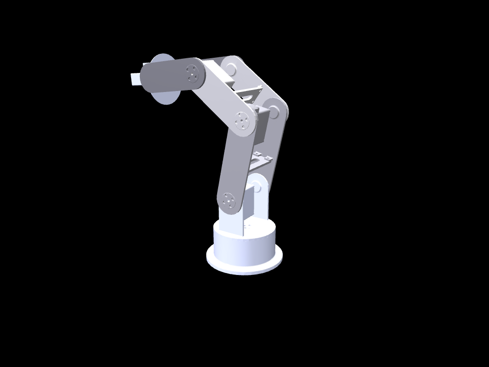
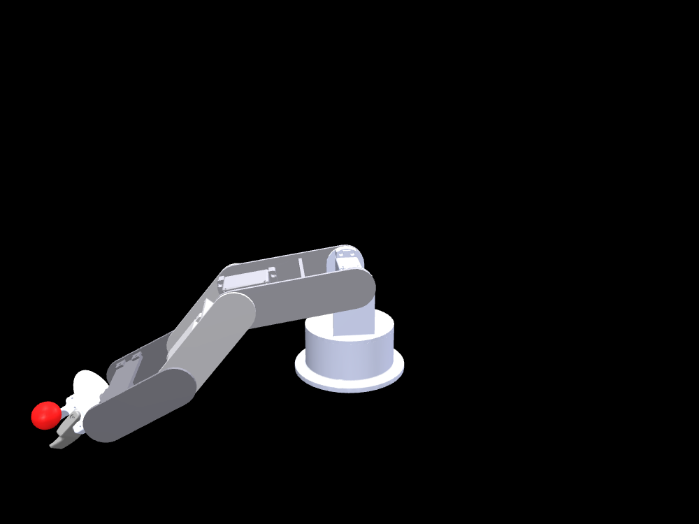

# MG995 6-DOF Robot Arm — MuJoCo Simulator

This is the official simulator for the
[arm_description](https://github.com/dasunsanjaya080/arm_description)
robot arm package.

<p align="center">
  
  
  
</p>

Interactive simulation of a 3D-printed 6-DOF robot arm driven by MG995
hobby servos, with an MG90 metal-gear claw. Drag sliders to command joint
angles; the sim shows the **real servo droop** you would see on the
physical arm. In the right-hand shot the red sphere marks where the claw
*would* be with ideal servos — the gap is genuine gravity sag against the
1.13 N·m torque limit.


## Features

- Loads a plain URDF (`arm.urdf`) directly in MuJoCo — no conversion step needed
- Six position servo actuators torque-limited to **1.13 N·m** (MG995 stall @ 6 V)
- Planned **45 g MG90 claw** modeled as tip mass, so sag matches the real build
- Explicit gravity (9.81 m/s²) with `implicitfast` integration
- Live feedback while you drive the sliders:
  - **red ghost sphere** — where the claw *should* be with perfect servos
  - **claw tint** green → red as tip error grows (0–40 mm)
  - **console readout** of per-joint tracking error and tip sag

## Install

Requires Python 3.10+ and [uv](https://docs.astral.sh/uv/) (recommended):

```bash
git clone https://github.com/rus1ru/arm_eval.git
cd arm_eval
uv pip install mujoco numpy        # into your env, or:
uv venv .venv && uv pip install --python .venv/bin/python mujoco numpy
```

Or with plain pip:

```bash
python -m venv .venv && source .venv/bin/activate
pip install mujoco numpy
```

## Run

```bash
uv run arm_sim.py          # or: python arm_sim.py
```

A viewer window opens with the arm rendered.

- **Control panel** — one slider per joint (`J1_base_yaw` … `J6_wrist_roll`)
- Watch the red sphere separate from the claw in loaded poses — that gap
  is genuine gravity sag against the servo torque limit (~2° at J2/J3,
  ~12 mm at the tip in typical poses)
- Mouse drag orbits / zooms; close the window or Ctrl+C to quit

## Files

| file | purpose |
|---|---|
| `arm_sim.py` | builds the model from URDF, injects servos, runs the interactive viewer |
| `arm.urdf` | self-contained robot description (relative mesh paths) |
| `meshes/` | link STL meshes |
| `arm.xml` | generated MJCF — rebuilt automatically each run |
| `assets/` | rendered screenshots used in this README |

## Hardware notes (validated against this model)

| joint | servo | worst-case load | utilization |
|---|---|---|---|
| J2 shoulder | MG995 (11.5 kg·cm) | 7.2 kg·cm | 62 % stall |
| J3 elbow | MG995 | 3.6 kg·cm | 32 % |
| J4 wrist pitch | MG90-class OK | 1.6 kg·cm | 62 % |
| J5 / J6 wrist roll | MG90 | ≈0.1 kg·cm | <4 % |

Self-collision is disabled intentionally: the raw CAD STLs interpenetrate
across joints and would jam the servos with phantom contact forces.

## License

MIT
